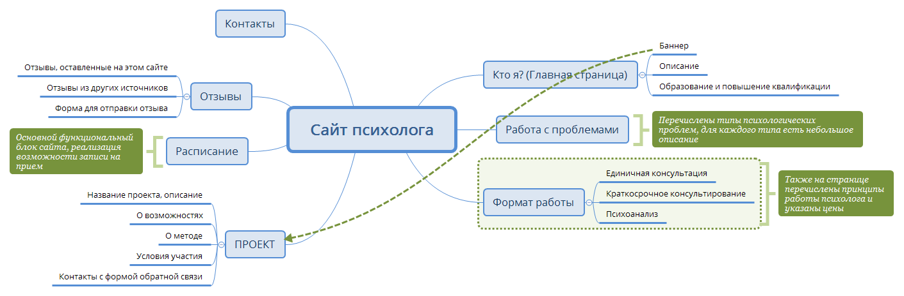
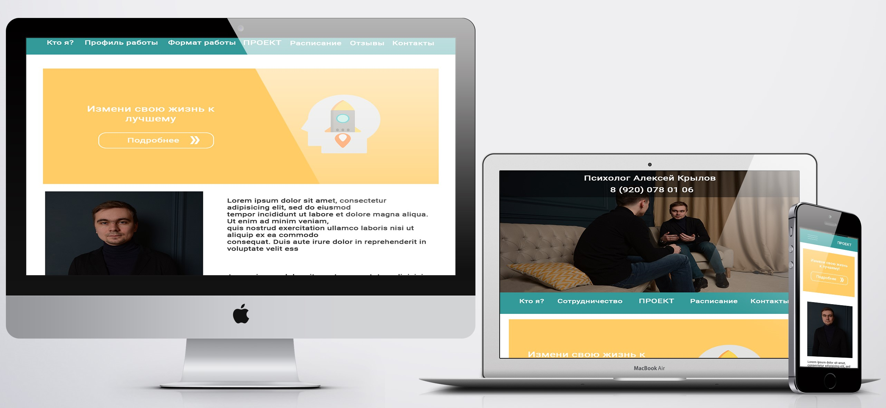
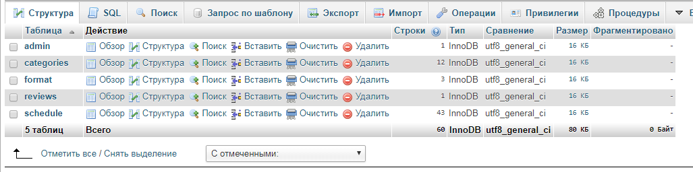

# Сайт для психолога Алексея Крылова
Дипломная работа для курса Web-технологии ННГУ им. Лобачевского (2018 г.)

## Описание
Проект - сайт для продвижения услуг психолога в Нижнем Новгороде. 
Основное назначение - привлечение новых клиентов. Наиболее приоритетная задача - привлечение клиентов к участию в проекте.

## Демо
Сайт был размещен на хостинге Спринтхост. 
Посмотреть скринкаст по сайту можно [здесь](https://youtu.be/p-DuczZ21Yc). 

## Используемые технологии
1. HTML5, CSS3
2. Флексбокс-верстка, Grid-css, oтзывчивая вёрстка
3. Кроссбраузерность
4. JavaScript, jQuery
5. PHP 7
6. MySQL
7. Библиотеки Owl-carousel, Animate, Masked, Remodal-master, Lightbox

## Инструменты
1. Photoshop
2. XMind
3. Денвер
4. Яндекс.Метрика
5. Google Analytics
6. FileZilla

## Структура проекта
 

## Дизайн
 

## Функционал сайта
1. Расписание. Возможность отправить заявку на удобное для консультации время - наиболее важная функция сайта.
2. Форма для отзыва, включающая текстовое поле, поле для имени и поле для темы психологического запроса.
3. Форма обратной связи для участия в проекте.
4. Форма, позволяющая задать вопрос психологу.
5. Слайдер с документами, потверждающими квалификацию, включает миниатюры сканов документов, предустмотрена возможность просмотра полноразмерных изображений во всплывающем окне.
6. Административная часть, позволяющая удалять/добавлять записи в расписание, представляет собой ряд запросов к базе данных, написанных в виде формы.

## База данных
 
* admin - данные для авторизации администратора сайта
* categories - информация о типах проблем, расположенных на странице «Работа с проблемами»
* format – информация о формате работы
* reviews - имя человека, оставившего отзыв, краткая характеристика проблемы, отзыв
* schedule - информация о записях на консультацию, в нее ведется запись пользователей сайта на прием

## SEO сайта
* Уникальные тексты.
* Тег title оптимизирован под продвигаемые на странице запросы.
* Соблюдена иерархия заголовков h1-h6.
* Картинки содержат атрибут alt.
* Реализован ЧПУ, удовлетворяющий двум требованиям: содержание ключевой фразы и максимальная лаконичность.
* Установлены счетчики Яндекс.Метрика и Google Analytics.
* Проведена оптимизация скорости загрузки сайта.

### Авторское право
Автор иконок на сайте: [Freepik](https://www.freepik.com/) from [Flaticon](https://www.flaticon.com/)
